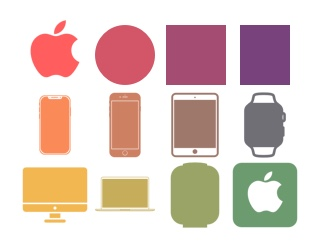

# WWDC_2018
Apple WWDC 2018 Scholarship Application (Submitted)

# Welcome to Colorpad
The fact of knowing about code doesn't necessarily mean that the 🚶‍♂️ is a 👽 regarding design matters (or at least it doesn't need to be). Based on a 👩‍💻 perspective (from the one who is speaking), makes sense to admit that most of the 👩‍💻 have a lack of "trained 👁" for 🎨, so I decided to create a 🎮 in which future or current 👨‍💻 can train their 👀 to better identify 🎨 and their gradients.
Colorpad is a puzzle 🎮 composed by 🎨 gradients and the main 🎯 is to correct the disposition of the 🎨 to match the correct sequence. The players can improve the experience by choosing personalised forms where they can apply to the 🎨: from a simple square to any 🍎 product.
Colorpad is a new way to learn about colors and their gradients.

# Game Mode:
You can choose your 🎮 mode between **Easy**, **Hard** and **Impossible**. Yes, Impossible. If you complete it, you definitely must be proud of your accomplishment👏🎉🎊. That's not for everyone!
The difference from one mode to another is the 🔢 of 🔓 🎨 that help you to complete the puzzle.
```
var difficult:Difficult = .easy
```

# Colors
To define the number of colors you just need set the quantity of Rows and Columns **(from 3 to 7)**. Be aware that high number of 🎨 increase the dificulty of your game.
Well, I have faith on you 🙏, but don't be so pushy. Start with less😉.
Ahhh, by the way, the 🎨 gradients are randomly generated, so you can ▶️ multiple times and improve your 👁.
```
var rows = 5

var columns = 5
```

# Forms
Of course the 🎮 wouldn't 🏁 right here. Sometimes play with ◻️ will get a little bit 😪, so thinking on these moments the 🎮 also provides you the option to change the square for your 😍 🍎 device, and also other forms or 🔢.



```
var boardType:BoardType = .square
```
# HAVE FUN!
Made by Luca Iaconelli
